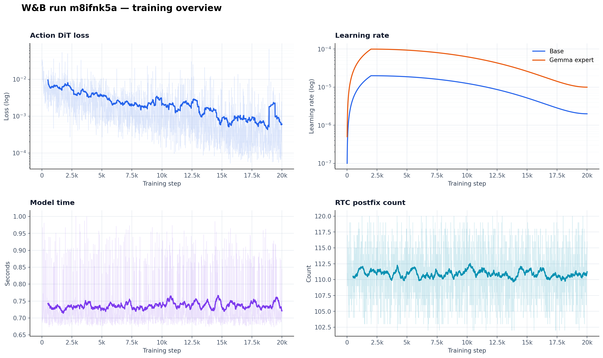
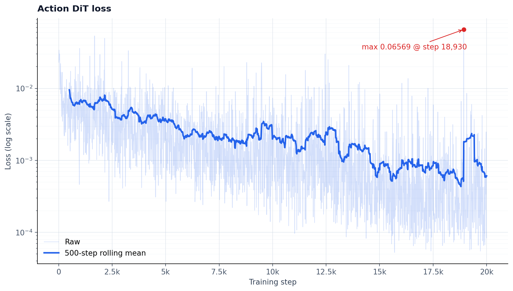
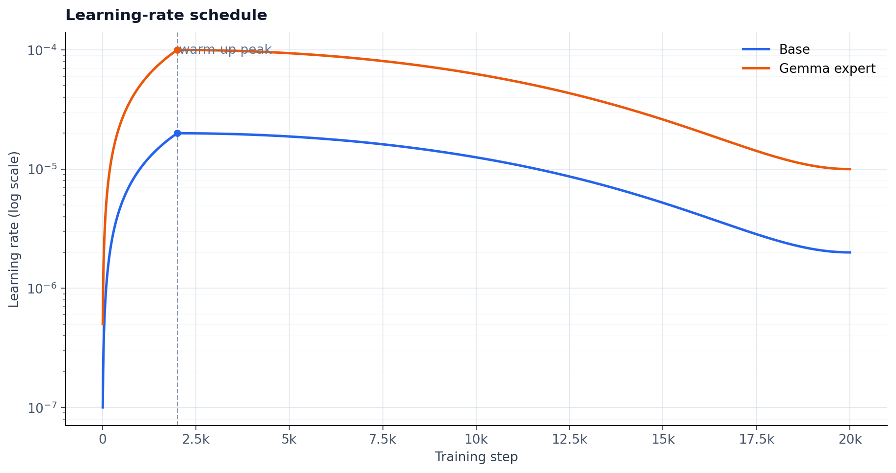
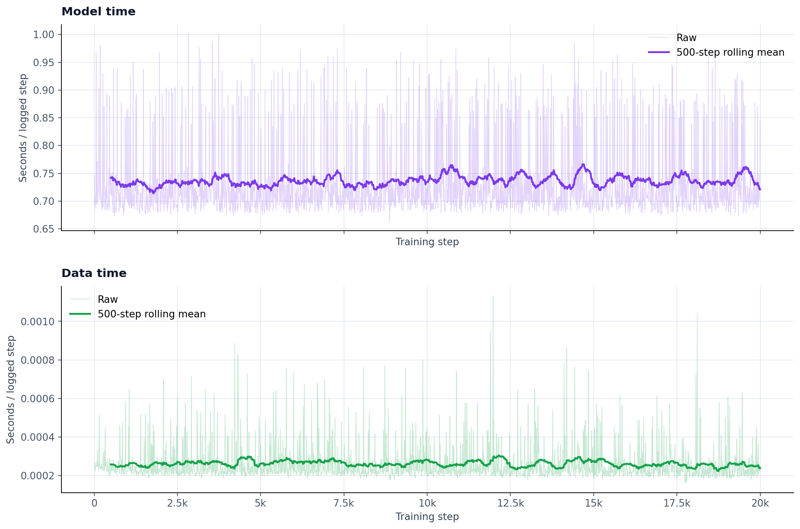
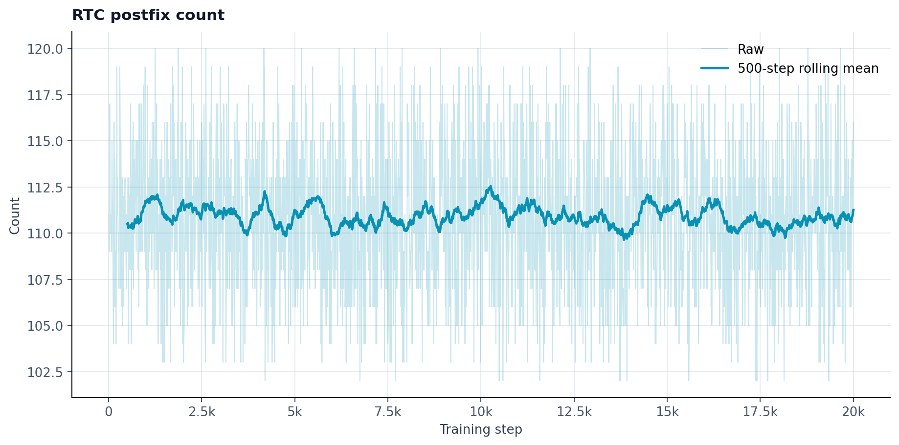

# W&B 训练曲线：`input_frame_rel_ee6d_soft_hand_abs_state_20260807_024054`

## Run 信息

| 字段 | 值 |
|---|---|
| W&B run ID | `m8ifnk5a` |
| Project | `starVLA_Pi05_Kitt15_v3_EE6D` |
| Group | `vla-train` |
| 原始 host | `dlcljsgzuanhlhto-master-0` |
| Git commit | `1766d3d03efb8d8d3cb91380e72eda83441bab39` |
| 训练范围 | step 10–20,000，epoch 0.00–2.25 |
| 历史点数 | 2,000（每 10 step 记录一次） |
| Run runtime | 4h 11m 07s |
| 离线源文件 | `/mnt/nas_data/guqiupeng/starvla_pi0.5/playground/checkpoints/input_frame_rel_ee6d_soft_hand_abs_state_20260807_024054/wandb/wandb/offline-run-20260807_024730-m8ifnk5a/run-m8ifnk5a.wandb` |

## 结论摘要

- `action_dit_loss` 的前 100 个记录点均值为 **0.008094**，最后 100 个记录点均值为 **0.000786**，下降 **90.3%**；最后 100 点中位数为 **0.000309**。
- loss 全局最大值 **0.065694** 出现在 step **18,930**。相邻记录很快恢复，属于孤立尖峰；建议结合该 batch 的样本与梯度日志进一步排查。
- 两组学习率均在 step **2,000** 达到峰值：base **2.00e-05**、Gemma expert **1.00e-04**；step 20,000 时均衰减到峰值的 10%（分别为 **2.00e-06**、**1.00e-05**）。
- `timing/model` 中位数 **0.710s**、P95 **0.904s**；`timing/data` 中位数 **0.000226s**、P95 **0.000464s**，没有明显随训练进度恶化。
- `rtc_postfix_count` 范围为 **102–120**，中位数 **111**，整体稳定。

## 分项曲线

### Action DiT loss

### Learning rate

### Timing

### RTC postfix count

## 文件说明

- `history.csv`：从离线 `.wandb` 文件提取的 2,000 条 scalar history，可用于进一步分析。
- 图中的趋势线为 **50 个记录点（约 500 training steps）滚动均值**；原始曲线仍以低透明度保留。
- loss 和 learning rate 使用对数纵轴，以便同时观察早期高值和后期低值。
